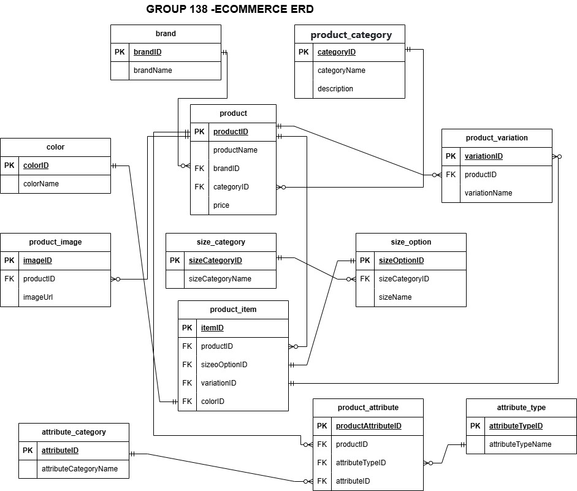

                                      E-commerce Database Design

**Overview**

This is a full MySQL database schema for an e-commerce site, created to handle complex product variations, attributes, categories, and inventory. The schema supports modern e-commerce requirements like multi-variant products, complex attribute systems, and flexible categorization.

**Features**

          DATABASE TABLES
           
**Core Tables**

brand - Stores brand information

product_category - Categorizes products by hierarchy

product - Base product information

product_item - Variants of the product (size, color selection)

**Variation Management**

color - Color selections

size_category - Sizes categorized by type (shirt, shoes)

size_option - Individual size (S, M, L, 42)

product_variation - Identifies variation types for the product

**Attribute System**

attribute_type - Data types for attributes (text, number, boolean)

attribute_category - Groups attributes by theme

product_attribute - Defines available attributes

product_attribute_value - Stores attribute values for products

Media
product_image - Product images and thumbnails

**Installation**

1. Clone this repository
  git clone https://github.com/TabbyWambui331/Ecommerce_grp_138.git

2. Execute the SQL script in your MySQL environment
**Usage**

**Contributing**

Contributions are welcome from you! Could you submit a pull request for any improvements?

**Licence**

This project is licensed under the MIT License. See the LICENSE file for details.
(https://mit-license.org/)

